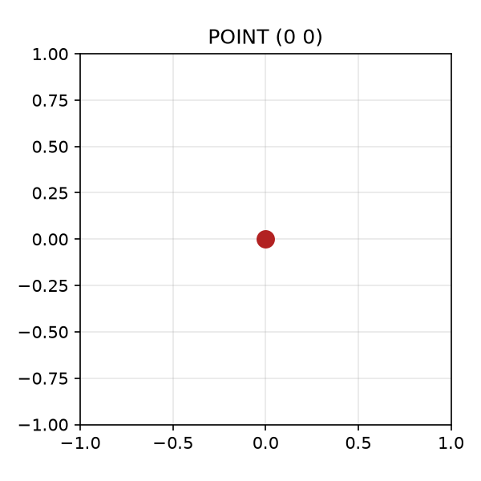
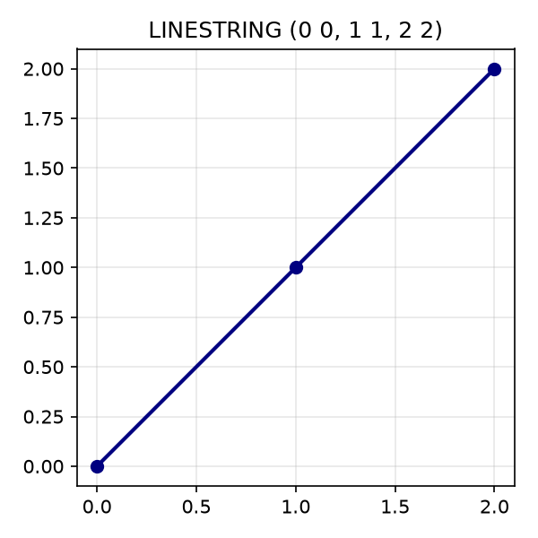
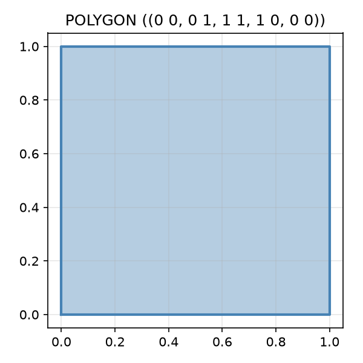

## Geo Spatial Databricks

### Introduction
In the following series of blog posts focuses on working with geospatial data with Databricks.
The topic of geo-spatial data is pretty complicated per-se, because it covers a broad range of domain knowledge such 
as industry standards, math and geography knowledge 

The series is primarily targeted an newcomers who never worked with geo-spatial data before and will cover everything starting 
from the theoretical basis to deep technical details on one case study. 

The seres will consist of the following parts 

Part 1: ST_* functions - Theory: WSG 84, WKT, WKB, EWKT, EWKB  formats (geo-json, geo-parquet); Types: geometry vs geograpy; Operations ; geo-hashing; performance and 
Part 2: H3_* Functions 
Part 3: Visualisation and debugging
Part 3: Data Quality and Generation 
Part 4: Data sources - OSM, Overture Maps etc.
Part 5: Case study - enriching location information with geo data.

# Theory
Before dividing into specific the Databricks API's or any related technologies it worth laying down some theoretical
basis's that will help in later understanding of the internals and purpose of specific implementations. 

In simple words, geospatial data describes positional and territorial data on the globe. Broadly speaking, this can have
a wide variate shapes: satellite images, geodesic data about terrains, positional data and so on. For the sake of brevity
our main focus will be on the last type of data - positional, since this is kind of data that Databricks platform provides 
most possibility to work with. 

Needless that basic math abstraction to work with structural geospatial data is a notion of coordinates defined
by [longitude](https://en.wikipedia.org/wiki/Longitude) and [latitude](https://en.wikipedia.org/wiki/Latitude_).
Although this math tool is not enough to identify a position on Earth with necessary precision. This is where [coordinate
reference systems](https://en.wikipedia.org/wiki/Spatial_reference_system) come into play which define datum necessary
to make precise calculations for the coordinates. In further readings you will see a lot of mentions [WGS_84](https://en.wikipedia.org/wiki/World_Geodetic_System#WGS_84)
standard. WGS 84 reference system is used by Global Position System.

Another popular name for that system that you will see in further documentations and references is SRID 4326 or just [4326](https://epsg.org/crs_4326/WGS-84.html)
which is the code it registed in [EPSG Geodetic Parameter Dataset](https://en.wikipedia.org/wiki/EPSG_Geodetic_Parameter_Dataset).

Single coordinate is required building block to work with geo data, but along this is not sufficient. This is primitive
for describing a single point on a map. However, in most of the type we would need to work with more complex geometric
objects to solve real world problems, such as lines and polygons. 
[Well Known Text](https://en.wikipedia.org/wiki/Well-known_text_representation_of_geometry) format received a broad 
application. WKT markup language supports four dimensions: X, Y, Z and M (measure). please, don't confuse X and Y with
longitude and  latitude so far, this will be covered later. Most of the time we will work first two dimensions, but awareness
about format's whole potential might be beneficial.  

Some examples of encoded objects:
`POINT (0 0)` - represents a point at coordinates `X=0` and `Y=0`;
 

`LINESTRING (0 0, 1 1, 2 2)` - strict line that connects dots at `X=0,Y=0`, `X=1,Y=1` and `X=2,Y=2`

`POLYGON ((0 0, 0 1, 1 1, 1 0, 0 0))` - square polygon starting and finishing at `0,0`.

For storage optimisation purposes usually used related well-known binary (WKB) representations that encodes same 
string into compressed binary.

As it was mentioned earlier, WKT language operates with abstract coordinates. To be more specific about used CRS,
extended well known text (EWKT) and extended well known binary (EWKB) formats can be used. It only adds  spatial reference system identifier (`SRID`)
prefix to a plain representation, such as `SRID=4326;POINT(0 0)`. 

Great now we have necessary building blocks to operate with spacial objects. Next logical step would a way to define 
relationship with between them. This is where [Dimensionally Extended 9-Intersection Model (DE-9IM)](https://en.wikipedia.org/wiki/DE-9IM)
comes into play. This model gives precise declarations of relation between geometrical objects.
To stay on the topic and for the sake of simplicity, lets consider these relations on examples of geometrical objects
represented using WKT language.

Equals
Two geometric objects interior and exterior matches.
For example: `POLYGON ((0 0, 0 1, 1 1, 1 0, 0 0))` and `POLYGON ((0 0, 1 0, 1 1, 0 1, 0 0))` - as you may see on these 
two polygons have slightly different representation, but essentially same figures.

Disjoin
Two geometric objects does not have any points in common.
`POLYGON ((0 0, 0 1, 1 1, 1 0, 0 0))` and `POLYGON ((2 2, 3 2, 3 3, 2 3, 2 2))` - you may observe that these 
two distant polygons have nothing in common.

Touches
Two geometric objects share external boundaries (or exterior), but don't share internal space (or interior):
`POLYGON ((0 0, 0 1, 1 1, 1 0, 0 0))` and `POLYGON ((1 1, 1 2, 2 2, 2 1, 1 1))` - in this example polygons share a 
single point. 

Contains 
First geometric object covers interior of the second geometric object WITHOUT sharing boundaries.
`POLYGON ((0 0, 0 3, 3 3, 3 0, 0 0))` and `POLYGON ((1 1, 1 2, 2 2, 2 1, 1 1))` - in this example, interior of the 
first polygon contains interior of the second polygon and both of them do not share boundaries.

Covers
"Covers" pretty similar to "contains" with one important difference - two polygons CAN share same boundaries. 
Lets consider slight modification of the example of the previous example: `POLYGON ((0 0, 0 3, 3 3, 3 0, 0 0))` 
and `POLYGON ((1 1, 1 3, 3 3, 3 1, 1 1))`. As you may see interiors are still covered, but polygons now share a boundary.

Intersects
First geometric object interior and boundaries intersects with interior and boundaries of the other one. 
For instance: `POLYGON ((0 0, 0 3, 3 3, 3 0, 0 0))` and `POLYGON ((1 1, 1 4, 4 4, 4 1, 1 1))`. This time the boundaries 
and interior of the second polygon exceeds the first one.

Within
This is opposite relation to "Contains" - if first geometry is contained by the second one.

formats (geo-json, geo-parquet), geo-hashing, geometry vs geograpy

https://en.wikipedia.org/wiki/Geohash
 

## References
- https://en.wikipedia.org/wiki/World_Geodetic_System
- https://libgeos.org/specifications/wkt/
- https://en.wikipedia.org/wiki/Well-known_text_representation_of_geometry
- https://en.wikipedia.org/wiki/DE-9IM