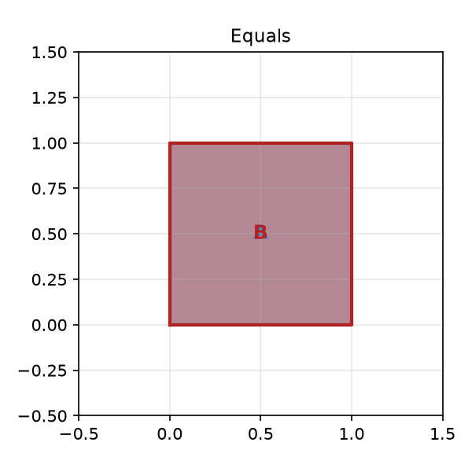
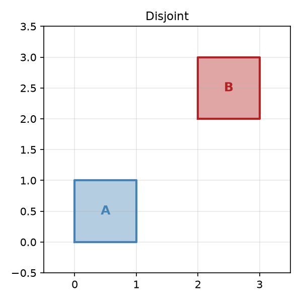
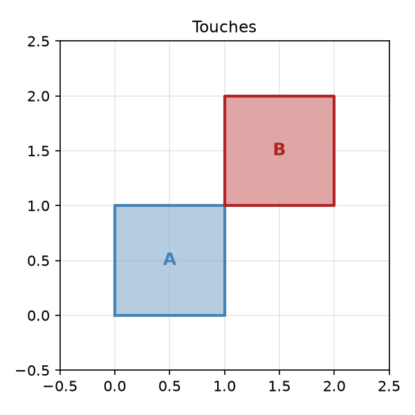
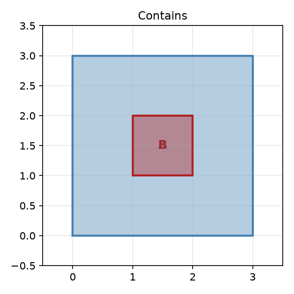
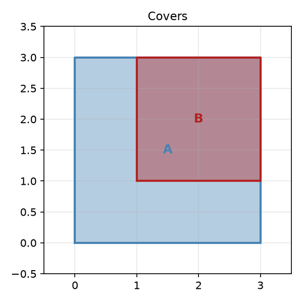
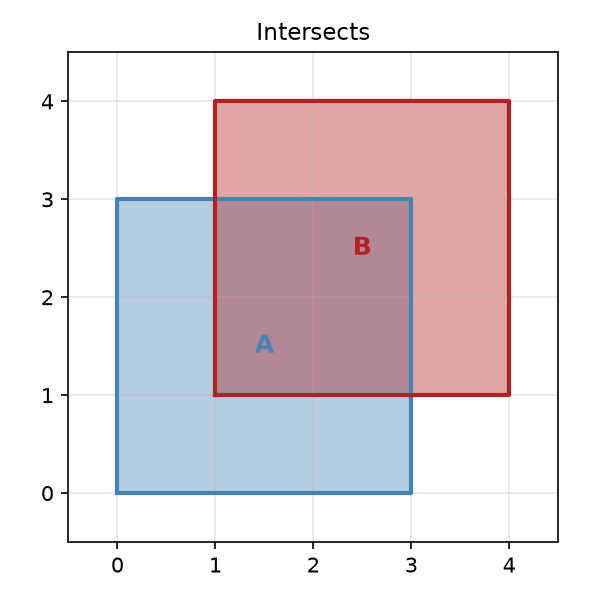
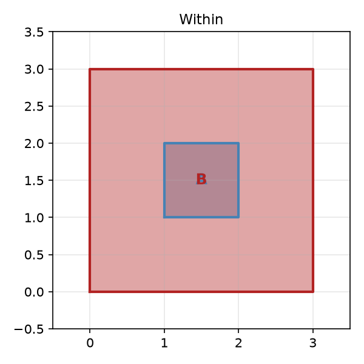

## Geospatial Data in Databricks — Part 0: Theory

### Introduction

The following series of blog posts focuses on working with geospatial data in Databricks. Geospatial data is a broad and complex topic — it spans a wide range of domain knowledge, including industry standards, mathematics, and geography.

The series is primarily targeted at newcomers who have never worked with geospatial data before and will cover everything from the theoretical foundations to deep technical details through a hands-on case study.

The series will consist of the following parts:

- **Part 0: Theory** 
- **Part 1: ST_\* Functions**
- **Part 2: H3_\* Functions**
- **Part 3: Visualization and Debugging**
- **Part 4: Data Quality and Generation**
- **Part 5: Data Sources**
- **Part 6: Case Studies**

Before diving into the Databricks APIs or any related technologies, it is worth laying down some theoretical foundations that will aid in understanding the internals and purpose of specific implementations.

In simple terms, geospatial data describes positional and territorial information on the globe. Broadly speaking, it can take a wide variety of forms: satellite imagery, geodesic terrain data, positional data, and more. For the sake of focus, this series concentrates on the last type — positional data — since that is the category Databricks provides the richest tooling for.

### Spatial Reference

The fundamental mathematical abstraction for working with structured geospatial data is the notion of coordinates defined by [longitude](https://en.wikipedia.org/wiki/Longitude) and [latitude](https://en.wikipedia.org/wiki/Latitude). However, coordinates alone are not sufficient to identify a position on Earth with the required precision. This is where [coordinate reference systems (CRS)](https://en.wikipedia.org/wiki/Spatial_reference_system) come into play — they define the datum needed to perform precise calculations on coordinates. In the readings that follow, you will frequently encounter the [WGS 84](https://en.wikipedia.org/wiki/World_Geodetic_System#WGS_84) standard, which is the reference system used by the Global Positioning System.

Another common name you will come across in documentation and references is **SRID 4326**, or simply [4326](https://epsg.org/crs_4326/WGS-84.html) — the code under which it is registered in the [EPSG Geodetic Parameter Dataset](https://en.wikipedia.org/wiki/EPSG_Geodetic_Parameter_Dataset).

### Well-Known Text

A single coordinate is the most basic building block for working with geospatial data, but on its own it is only sufficient for describing a single point on a map. In most real-world scenarios, we need to work with more complex geometric objects such as lines and polygons. This is where the [Well-Known Text (WKT)](https://en.wikipedia.org/wiki/Well-known_text_representation_of_geometry) format has found broad adoption. WKT is a markup language that supports four dimensions: X, Y, Z, and M (measure). Note that the mapping of X and Y axes to geographic coordinates depends on the implementation; in WGS 84, X corresponds to longitude and Y to latitude. Most practical work involves only the first two dimensions, but awareness of the full potential of the format can be beneficial.

Some examples of WKT-encoded objects:

`POINT (0 0)` — a point at coordinates `X=0`, `Y=0`


`LINESTRING (0 0, 1 1, 2 2)` — a straight line connecting the points at `X=0,Y=0`, `X=1,Y=1`, and `X=2,Y=2`


`POLYGON ((0 0, 0 1, 1 1, 1 0, 0 0))` — a square polygon starting and ending at `(0,0)`


For storage efficiency, the related **Well-Known Binary (WKB)** format is typically used — it encodes the same geometric objects as compressed binary data.

As mentioned earlier, WKT operates with abstract coordinates. To be more explicit about the coordinate reference system in use, the **Extended Well-Known Text (EWKT)** and **Extended Well-Known Binary (EWKB)** formats can be used. They simply prepend a spatial reference system identifier (`SRID`) to the standard representation — for example: `SRID=4326;POINT(0 0)`.

### Relations and DE-9IM
With the necessary building blocks in place, the next logical step is defining how geometric objects relate to one another. This is where the [Dimensionally Extended 9-Intersection Model (DE-9IM)](https://en.wikipedia.org/wiki/DE-9IM) comes into play. This model provides precise definitions of relationships between geometric objects.
As we will see in Part 1, this model underpins the entire `ST_*` family of functions.

For the sake of clarity and brevity, let's explore these relations using WKT examples.

**Equals**
Two geometric objects whose interiors and exteriors match exactly.
For example, `POLYGON ((0 0, 0 1, 1 1, 1 0, 0 0))` and `POLYGON ((0 0, 1 0, 1 1, 0 1, 0 0))` have slightly different vertex orderings but represent the same figure.


**Disjoint**
Two geometric objects that share no points in common.
`POLYGON ((0 0, 0 1, 1 1, 1 0, 0 0))` and `POLYGON ((2 2, 3 2, 3 3, 2 3, 2 2))` — these two polygons are completely separate.


**Touches**
Two geometric objects that share boundary points but do not share any interior space.
`POLYGON ((0 0, 0 1, 1 1, 1 0, 0 0))` and `POLYGON ((1 1, 1 2, 2 2, 2 1, 1 1))` — these polygons meet at a single point.


**Contains**
The first geometric object's interior fully covers the second object's interior, without sharing any boundaries.
`POLYGON ((0 0, 0 3, 3 3, 3 0, 0 0))` and `POLYGON ((1 1, 1 2, 2 2, 2 1, 1 1))` — the larger polygon contains the smaller one entirely, with no shared boundaries.


**Covers**
Similar to *Contains*, but the two objects may share boundaries.
Consider a slight modification: `POLYGON ((0 0, 0 3, 3 3, 3 0, 0 0))` and `POLYGON ((1 1, 1 3, 3 3, 3 1, 1 1))` — the interior of the second polygon is still fully covered by the first, but they now share a boundary.


**Intersects**
The interior and boundaries of the first geometric object overlap with those of the second.
For instance: `POLYGON ((0 0, 0 3, 3 3, 3 0, 0 0))` and `POLYGON ((1 1, 1 4, 4 4, 4 1, 1 1))` — the second polygon partially overlaps and extends beyond the first.


**Within**
The inverse of *Contains* — the first geometry is fully contained by the second.
`POLYGON ((1 1, 1 2, 2 2, 2 1, 1 1))` and `POLYGON ((0 0, 0 3, 3 3, 3 0, 0 0))` — the smaller polygon lies entirely inside the larger one, with no shared boundaries.


### Open Formats

Working with geometric objects and their relationships is essential, but in many practical scenarios it is not sufficient on its own. Most real-world use cases require carrying additional business context alongside geometric data. This is where open standards such as **GeoJSON** and **GeoParquet** become valuable — they provide standardized structures for enriched geospatial data that are widely supported across tools and systems.

#### GeoJSON

[GeoJSON](https://geojson.org) is a JSON-based format for describing geographic primitives such as points, lines, and polygons, along with arbitrary additional properties.

For example, to represent vehicle movement with `timestamp`, `speed`, and `heading` attributes:

```json
{
  "type": "FeatureCollection",
  "features": [
    {
      "type": "Feature",
      "geometry": {
        "type": "Point",
        "coordinates": [30.5234, 50.4501]
      },
      "properties": {
        "timestamp": "2026-06-30T10:00:00Z",
        "speed": 52.3,
        "heading": 45
      }
    },
    {
      "type": "Feature",
      "geometry": {
        "type": "Point",
        "coordinates": [30.5235, 50.4510]
      },
      "properties": {
        "timestamp": "2026-06-30T10:00:30Z",
        "speed": 48.1,
        "heading": 42
      }
    }
  ]
}
```

You can visualize this example interactively using online tools such as [geojson.io](https://geojson.io).

#### GeoParquet

While GeoJSON is capable enough for many everyday tasks, JSON as a format has notable drawbacks at scale: it lacks native compression, and storing large datasets requires the JSON Lines format rather than a single structured file.

Since [Parquet](https://www.databricks.com/blog/what-is-parquet) has become the de facto standard for MPP engines like Apache Spark, [GeoParquet](https://geoparquet.org) can be seen as the natural evolution of the GeoJSON approach — using Parquet as the underlying format. The previous GeoJSON example can be converted using [geoparquet.org/convert](https://geoparquet.org/convert/) to illustrate the resulting schema:

```
message {
  optional int64 timestamp (TIMESTAMP (MILLIS, true));
  optional double speed;
  optional int32 heading;
  optional binary geometry;
}
```

And the corresponding metadata (abbreviated for brevity):

```json
{
  "primary_column": "geometry",
  "columns": {
    "geometry": {
      "encoding": "WKB",
      "crs": { ... }
    }
  },
  "version": "1.0.0",
  "creator": {
    "library": "geopandas",
    "version": "1.1.4"
  }
}
```

As you can see, it is essentially a standard Parquet file with one notable difference — a `geometry` binary column. This column stores the WKB encoding of the two `POINT` geometries from our earlier GeoJSON example.

### Types: Geometry and Geography

Apache Parquet's [latest specification](https://github.com/apache/parquet-format/blob/94b9d631aef332c78b8f1482fb032743a9c3c407/Geospatial.md#logical-types) defines two logical types for representing geospatial objects:

- [GEOMETRY](https://github.com/apache/parquet-format/blob/94b9d631aef332c78b8f1482fb032743a9c3c407/LogicalTypes.md#geometry)
- [GEOGRAPHY](https://github.com/apache/parquet-format/blob/94b9d631aef332c78b8f1482fb032743a9c3c407/LogicalTypes.md#geography)

These types are currently in the adoption phase, though a number of vendors already provide support for them — including Databricks, which exposes them as native SQL types: [GEOMETRY](https://docs.databricks.com/aws/en/sql/language-manual/data-types/geometry-type) and [GEOGRAPHY](https://docs.databricks.com/aws/en/sql/language-manual/data-types/geography-type).

Both types represent geospatial objects (such as points and lines) in WKB format, with one important difference: `GEOMETRY` does not account for Earth's curvature, while `GEOGRAPHY` does. This distinction can significantly affect certain calculations — for example, the computed distance between two points may differ depending on which type is used.

### Conclusion

Now as you equipped with better domain understanding we can move one to more practical application. In the next post, we will explore the family of `ST_*` functions, which rely heavily on many of the concepts introduced here.

## References

- https://en.wikipedia.org/wiki/World_Geodetic_System
- https://libgeos.org/specifications/wkt/
- https://en.wikipedia.org/wiki/Well-known_text_representation_of_geometry
- https://en.wikipedia.org/wiki/DE-9IM
- https://xebia.com/blog/introducing-the-geoparquet-data-format/
- https://en.wikipedia.org/wiki/Simple_Features#Spatial
- https://community.databricks.com/t5/data-engineering/native-geometry-parquet-support/td-p/111465
- https://github.com/apache/parquet-format
