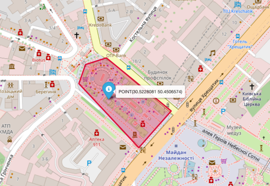

## Geospatial Data in Databricks — Part 1: ST_* Functions

### Introduction

The following series of blog posts focuses on working with geospatial data in Databricks. In the [previous part](https://medium.com/@ivan-kurchenko/01cb2ef77992) of the series, we outlined the theoretical foundations that will be referenced heavily here. In this post, we will explore the [`ST_*` family of functions](https://docs.databricks.com/aws/en/sql/language-manual/sql-ref-st-geospatial-functions-alpha).

A bit of historical context: spatial functions for SQL were first introduced in the "ISO 19125-2 (SFA-SQL)" standard, specifically in the "SQL/MM Spatial" section. The `ST_` prefix originally stood for Spatial and Temporal. Today, this standard is implemented by various vendors, so you may encounter the same `ST_` function signatures across other SQL implementations.

Databricks provides implementations for around 80 spatial functions in total. To keep things manageable, we will focus on a subset of them, organized by topic.

To keep the overview grounded, let's use [Independence Square in Kyiv, Ukraine](https://www.openstreetmap.org/?mlat=50.45&mlon=30.524167&zoom=15#map=18/50.450519/30.523340) as our running example.

> Note: `ST_*` functions are supported in Databricks Runtime 17.1 and higher.

### Types: GEOMETRY and GEOGRAPHY

Databricks supports two native spatial types — [`GEOMETRY`](https://docs.databricks.com/aws/en/sql/language-manual/data-types/geometry-type) and [`GEOGRAPHY`](https://docs.databricks.com/aws/en/sql/language-manual/data-types/geography-type). Although both represent spatial objects, they differ fundamentally in how they model the Earth:

- `GEOMETRY` uses a **planar** (flat-Earth) model. Coordinates are treated as Cartesian (x, y), and calculations ignore Earth's curvature. This makes it faster and well-suited for local or small-area analysis.
- `GEOGRAPHY` uses a **spherical** model. Coordinates are treated as latitude/longitude on the globe, and calculations account for Earth's curvature. This is slower but gives accurate results for large distances and global datasets.

Neither type can be directly persisted: you cannot write a DataFrame containing `GEOMETRY` or `GEOGRAPHY` columns to a Delta table or any other storage format.

In [the previous post](https://medium.com/p/01cb2ef77992/edit), the "Well Known" markup formats were introduced for exactly this purpose. Let's start there.

### Deserialization

Before any manipulation of geospatial data in a DataFrame, we need to be able to read it. This makes deserialization the first group of functions to get familiar with — converting "Well Known" values into `GEOMETRY` and `GEOGRAPHY` types.

Databricks provides functions covering the full combination of source formats (WKT, WKB, EWKT, EWKB) and target types (`GEOMETRY` and `GEOGRAPHY`):

- [`st_geogfromwkt`](https://docs.databricks.com/aws/en/sql/language-manual/functions/st_geogfromwkt)
- [`st_geogfromwkb`](https://docs.databricks.com/aws/en/sql/language-manual/functions/st_geogfromwkb)
- [`st_geogfromewkt`](https://docs.databricks.com/aws/en/sql/language-manual/functions/st_geogfromewkt)

- [`st_geomfromewkb`](https://docs.databricks.com/aws/en/sql/language-manual/functions/st_geomfromewkb)
- [`st_geomfromewkt`](https://docs.databricks.com/aws/en/sql/language-manual/functions/st_geomfromewkt)
- [`st_geomfromwkb`](https://docs.databricks.com/aws/en/sql/language-manual/functions/st_geomfromwkb)
- [`st_geomfromwkt`](https://docs.databricks.com/aws/en/sql/language-manual/functions/st_geomfromwkt)

For example, converting from WKT looks like this:

```sql
SELECT st_geogfromwkt('POLYGON ((30.5235417 50.4499077, 30.5243239 50.4504775, 30.5227595 50.4512945, 30.522253 50.4511905, 30.5220898 50.4508967, 30.5235417 50.4499077))') AS polygon
```

### Serialization

To store spatial types back to a persistent format, they must be converted into one of the "Well Known" formats using one of the following functions:

- [`st_asewkb`](https://docs.databricks.com/aws/en/sql/language-manual/functions/st_asewkb)
- [`st_asewkt`](https://docs.databricks.com/aws/en/sql/language-manual/functions/st_asewkt)
- [`st_aswkb`](https://docs.databricks.com/aws/en/sql/language-manual/functions/st_aswkb)
- [`st_aswkt`](https://docs.databricks.com/aws/en/sql/language-manual/functions/st_aswkt)

Building on the previous example, we can convert the polygon geography back to an EWKT string:

```sql
SELECT st_asewkt(st_geogfromwkt('POLYGON ((30.5235417 50.4499077, 30.5243239 50.4504775, 30.5227595 50.4512945, 30.522253 50.4511905, 30.5220898 50.4508967, 30.5235417 50.4499077))')) AS polygon_ewkt
```

This returns the EWKT representation:

`SRID=4326;POLYGON((30.5235417 50.4499077,30.5243239 50.4504775,30.5227595 50.4512945,30.522253 50.4511905,30.5220898 50.4508967,30.5235417 50.4499077))`

The only noticeable difference is the explicit SRID prepended at the beginning.

### GeoJSON

GeoJSON, as covered in [the previous part](https://medium.com/@ivan-kurchenko/01cb2ef77992), is one of the open formats for working with spatial data. Its support is provided through the following functions:

- [`st_geogfromgeojson`](https://docs.databricks.com/aws/en/sql/language-manual/functions/st_geogfromgeojson)
- [`st_geomfromgeojson`](https://docs.databricks.com/aws/en/sql/language-manual/functions/st_geomfromgeojson)
- [`st_asgeojson`](https://docs.databricks.com/aws/en/sql/language-manual/functions/st_asgeojson)

For example, the following query converts our example polygon to GeoJSON:

```sql
SELECT st_asgeojson(st_geogfromwkt('POLYGON ((30.5235417 50.4499077, 30.5243239 50.4504775, 30.5227595 50.4512945, 30.522253 50.4511905, 30.5220898 50.4508967, 30.5235417 50.4499077))'))
```

Which produces:

```json
{"type":"Polygon","coordinates":[[[30.5235417,50.4499077],[30.5243239,50.4504775],[30.5227595,50.4512945],[30.522253,50.4511905],[30.5220898,50.4508967],[30.5235417,50.4499077]]]}
```

Note that this value is a [`Geometry`](https://datatracker.ietf.org/doc/html/rfc7946#section-3.1) object in GeoJSON terms. To construct a complete GeoJSON document, the result would need to be wrapped into a [`Feature`](https://datatracker.ietf.org/doc/html/rfc7946#section-3.2) or [`FeatureCollection`](https://datatracker.ietf.org/doc/html/rfc7946#section-3.3).

### Distance

Once we have spatial types in memory, we can move on to analytical tasks such as measuring distances. The following functions support this:

- [`st_distance`](https://docs.databricks.com/aws/en/sql/language-manual/functions/st_distance)
- [`st_distancesphere`](https://docs.databricks.com/aws/en/sql/language-manual/functions/st_distancesphere)
- [`st_distancespheroid`](https://docs.databricks.com/aws/en/sql/language-manual/functions/st_distancespheroid)
- [`st_dwithin`](https://docs.databricks.com/aws/en/sql/language-manual/functions/st_dwithin)

For a more concrete example, let's measure the distance between Independence Square in Kyiv and [Market Square in Lviv, Ukraine](https://www.openstreetmap.org/#map=18/49.841913/24.030694).

Let's start with `st_distance`. Note that this function works only with the `GEOMETRY` type, which means surface curvature is not taken into account. The distance is returned in the same unit as the geometry is defined — in this case, degrees. To get an approximate distance in kilometers, the result must be [multiplied by 111](https://stackoverflow.com/questions/1253499/simple-calculations-for-working-with-lat-lon-and-km-distance):

```sql
SELECT st_distance( 
    st_geomfromwkt('POINT(24.0317835 49.8419343)'),
    st_geomfromwkt('POINT(30.5235417 50.4499077)')
) * 111 AS distance
```

This gives approximately 723 km. As you might expect, the result is not very accurate due to the nature of the calculation. The large discrepancy compared to the sphere-based functions below stems from the fact that `st_distance` treats coordinates as flat Cartesian values — it computes a straight-line Euclidean distance in degrees and then scales it.

A better alternative is `st_distancesphere`, which returns the distance in meters on a sphere using the mean radius of the WGS84 ellipsoid. This function is more restrictive and works only with `GEOMETRY` points:

```sql
SELECT st_distancesphere( 
    st_geomfromwkt('POINT(24.0317835 49.8419343)'),
    st_geomfromwkt('POINT(30.5235417 50.4499077)')
) / 1000 AS distance
```

This returns 467 kilometers.

The most accurate option is `st_distancespheroid`, which returns the geodesic distance on the WGS84 ellipsoid:

```sql
SELECT st_distancespheroid( 
    st_geomfromwkt('POINT(24.0317835 49.8419343)'),
    st_geomfromwkt('POINT(30.5235417 50.4499077)')
) / 1000 AS distance
```

This returns 468 kilometers.

A natural question arises: which one should you use? Listed from most accurate (but slowest) to least accurate (but fastest): `st_distancespheroid` → `st_distancesphere` → `st_distance`.

### Relations

Another important group of operations is determining the spatial relationship between objects. This is useful for various analytical scenarios, such as [geofencing](https://en.wikipedia.org/wiki/Geofence). The following functions support this:

- [`st_touches`](https://docs.databricks.com/aws/en/sql/language-manual/functions/st_touches)
- [`st_within`](https://docs.databricks.com/aws/en/sql/language-manual/functions/st_within)
- [`st_intersects`](https://docs.databricks.com/aws/en/sql/language-manual/functions/st_intersects)
- [`st_covers`](https://docs.databricks.com/aws/en/sql/language-manual/functions/st_covers)
- [`st_contains`](https://docs.databricks.com/aws/en/sql/language-manual/functions/st_contains)
- [`st_disjoint`](https://docs.databricks.com/aws/en/sql/language-manual/functions/st_disjoint)

All of these functions rely heavily on the DE-9IM model introduced in [the previous part](https://medium.com/@ivan-kurchenko/01cb2ef77992). For instance, we can check whether a point falls inside our example polygon:

```sql
SELECT st_contains(
    st_geomfromwkt('POLYGON((30.5235417 50.4499077, 30.5243239 50.4504775, 30.5227595 50.4512945, 30.522253 50.4511905, 30.5220898 50.4508967, 30.5235417 50.4499077))'),
    st_geomfromwkt('POINT(30.5228081 50.4506574)')
) AS contains
```

This returns `true`, as you can verify from the map below:



### Geo Hashing

[Geohash](https://en.wikipedia.org/wiki/Geohash) is part of a broader topic — geospatial indexing — which is outside the scope of this post. (H3, which will be covered in the next part, is another example of this concept.)

Working with geospatial data can be slow and cumbersome for certain problems, such as [reverse geocoding](https://en.wikipedia.org/wiki/Reverse_geocoding). Imagine working with traffic data where you need to calculate mileage driven per country. Such a dataset will most likely represent locations as longitude/latitude pairs. To map these locations to a human-readable representation — like a country name — you would need to run `st_contains` against each region. At scale, this becomes prohibitively slow, and a faster alternative is needed. This is exactly where Geohash and other spatial indexes shine.

Geohash subdivides the entire globe hierarchically into a grid of cells. Each cell has a distinct alphanumeric identifier within the hierarchy. As a result, any location can be encoded as a string of up to 12 characters, depending on the desired precision. That string can then be used as a key, making it far more suitable for operations like `JOIN`.

Databricks provides the following functions for working with Geohash:

- [`st_geohash`](https://docs.databricks.com/gcp/en/sql/language-manual/functions/st_geohash)
- [`st_geomfromgeohash`](https://docs.databricks.com/aws/en/sql/language-manual/functions/st_geomfromgeohash)
- [`st_pointfromgeohash`](https://docs.databricks.com/aws/en/sql/language-manual/functions/st_pointfromgeohash)

For instance, to encode our example point as a Geohash:

```sql
SELECT st_geohash(st_geomfromwkt('POINT(30.5228081 50.4506574)'), 6) AS geohash
```

`st_geohash` accepts a precision value as its second argument. You can think of precision as the hierarchy level, from coarse to fine. In this example, a precision of 6 covers an area of approximately 1.2 km × 0.6 km.

The query returns the value `u8vxn8`, which can be visualized as follows:


## Conclusion

In this part, we covered the main functions of the `ST_*` family. Some operations were intentionally left out of scope, such as geometry manipulation via [`st_rotate`](https://docs.databricks.com/aws/en/sql/language-manual/functions/st_rotate) or [`st_scale`](https://docs.databricks.com/aws/en/sql/language-manual/functions/st_scale). In the upcoming part, our focus will shift to [H3](https://docs.databricks.com/aws/en/sql/language-manual/sql-ref-h3-geospatial-functions) functions and the H3 spatial index.

## References

- https://docs.databricks.com/aws/en/sql/language-manual/sql-ref-st-geospatial-functions-alpha
- https://en.wikipedia.org/wiki/Simple_Features#Spatial
- https://dekart.xyz/blog/st_-prefix-in-sql-a-tale-of-time-space-and-standardization/
- https://spark.apache.org/docs/4.2.0-preview4/sql-ref-geospatial-types.html
- https://www.databricks.com/blog/introducing-spatial-sql-databricks-80-functions-high-performance-geospatial-analytics
