## Geospatial Data in Databricks — Part 2: H3_* functions

### Introduction
The following series of blog posts focuses on working with geospatial data in Databricks.
In the previous two parts of the series, we covered the theoretical basis and `ST_*` functions.
This post focuses on the [`H3_*` family of functions](https://docs.databricks.com/aws/en/sql/language-manual/sql-ref-h3-geospatial-functions).

A bit of historical and theoretical context. [H3 index](https://h3geo.org) was initially developed at Uber.
It is a discrete grid that subdivides the globe using [hexagons](https://en.wikipedia.org/wiki/Hexagon) mostly,
although it has exactly 12 [pentagons](https://en.wikipedia.org/wiki/Pentagon) at each resolution level.
The grid has a hierarchy of 16 levels. At each level, a cell subdivides into 7 cells, each indexed by a number. Hence, the resulting index value can have both numerical and string representations.
The cell at the top of the hierarchy (level 0) covers an area of approximately 4.25 million square kilometers, and the smallest cell (level 15) covers an area of about 0.9 square meters.

For more about the H3 index, it is strongly encouraged to visit the corresponding [learning resources](https://h3geo.org/docs/community/tutorials).
To enrich the overview, we will use the location example from the previous post: [Independence Square in Kyiv, Ukraine](https://www.openstreetmap.org/?mlat=50.45&mlon=30.524167&zoom=15#map=18/50.450519/30.523340).


### Importing
Unlike the previously covered `GEOMETRY` and `GEOGRAPHY` types, we don't need to perform any (de)serialization, since index values are natively serializable.
However, we still need a mechanism to convert values from familiar formats like WKT into indexes.
This is where we need the [import functions](https://docs.databricks.com/aws/en/sql/language-manual/sql-ref-h3-geospatial-functions#import).

#### Cover as H3
The most generic methods are:
- [h3_coverash3](https://docs.databricks.com/aws/en/sql/language-manual/functions/h3_coverash3) - converts WKT, WKB or GeoJSON into an array of H3 cell IDs as `BIGINT` type.
- [h3_coverash3string](https://docs.databricks.com/aws/en/sql/language-manual/functions/h3_coverash3string) - a variation of the previous function, but cell IDs are of `STRING` type.

The important detail to understand is that the cells returned cover the given geo object; in other words, the area of the cell includes the geo object and might be larger than it.

Let's consider the polygon example from the previous part and turn it into H3 cells with 9th precision.

```sql
select h3_coverash3string('POLYGON ((30.5235417 50.4499077, 30.5243239 50.4504775, 30.5227595 50.4512945, 30.522253 50.4511905, 30.5220898 50.4508967, 30.5235417 50.4499077))', 9)
```
Which returns the following array: `["891e6384a27ffff","891e6384a2fffff","891e6384a23ffff"]`

That can be visualized on the [h3 website](https://h3geo.org/#hex=891e6384a27ffff%2C891e6384a2fffff%2C891e6384a23ffff):
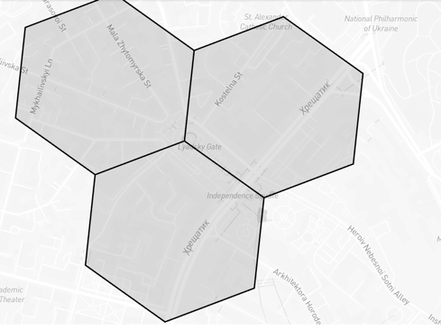

#### Convert long/lat to H3
Additionally, there are more narrowly focused functions doing a similar job:
- [h3_longlatash3](https://docs.databricks.com/aws/en/sql/language-manual/functions/h3_longlatash3) - get cell ID for long/lat and precision;
- [h3_longlatash3string](https://docs.databricks.com/aws/en/sql/language-manual/functions/h3_longlatash3string) - version for the string hex;

- [h3_pointash3](https://docs.databricks.com/aws/en/sql/language-manual/functions/h3_pointash3) - convert a `POINT` geometry from WKT, WKB or GeoJSON to an H3 cell ID.
- [h3_pointash3string](https://docs.databricks.com/aws/en/sql/language-manual/functions/h3_pointash3string) - version for the string hex;

For example the query:
```sql
select h3_longlatash3(30.524167, 50.45, 9)
```

returns cell "604016954579091455" that can visual as:
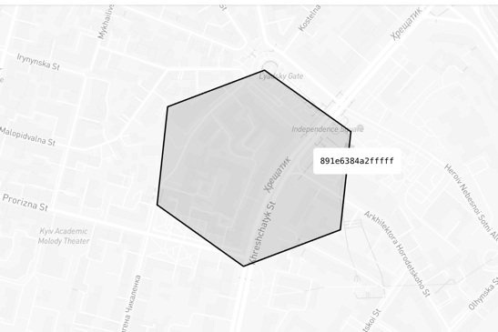

#### Polyfill as H3

[h3_polyfillash3](https://docs.databricks.com/aws/en/sql/language-manual/functions/h3_polyfillash3) and [h3_polyfillash3string](https://docs.databricks.com/aws/en/sql/language-manual/functions/h3_polyfillash3string) return cell IDs as `BIGINT` and `STRING` respectively.

Unlike `h3_coverash3`, `h3_polyfillash3` returns only cell IDs that lie strictly inside the input geo object. Hence, the following query returns an empty array as a result:
```sql
select h3_polyfillash3('POLYGON ((30.5235417 50.4499077, 30.5243239 50.4504775, 30.5227595 50.4512945, 30.522253 50.4511905, 30.5220898 50.4508967, 30.5235417 50.4499077))', 9)
```
Because an H3 cell with precision 9 covers roughly 105,000 square meters (~0.1 km²), which is much larger than the given polygon.

But with higher precision of 12:
```sql
select h3_polyfillash3('POLYGON ((30.5235417 50.4499077, 30.5243239 50.4504775, 30.5227595 50.4512945, 30.522253 50.4511905, 30.5220898 50.4508967, 30.5235417 50.4499077))', 12)
```
returns the array `["626534952618319871","626534952618348543","626534952617721855","626534952617734143","626534952617717759"]` that lies strictly inside the example polygon:
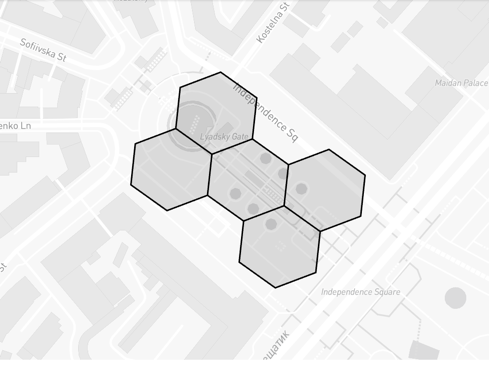

#### Tessellation
[h3_tessellateaswkb](https://docs.databricks.com/aws/en/sql/language-manual/functions/h3_tessellateaswkb) provides more advanced capabilities. It returns an array of structures with additional fields:
- `cellid` - the familiar H3 cell ID;
- `core` - a boolean flag indicating whether a cell is located on the edge (not core, `false`) or inside (core, `true`) of the area;
- `chip` - WKB that represents the intersection of the current cell and the given geometry.

For instance, you can leverage this function to get cell IDs that lie on the edge of the polygon:
```sql
select tessel.cellid
from (select explode(h3_tessellateaswkb('POLYGON ((30.5235417 50.4499077, 30.5243239 50.4504775, 30.5227595 50.4512945, 30.522253 50.4511905, 30.5220898 50.4508967, 30.5235417 50.4499077))', 12)) as tessel)
where tessel.core = false
```
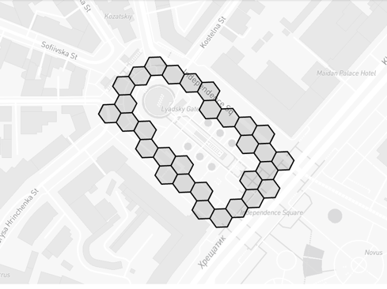

#### Safe import
Safe versions of the aforementioned functions that return a `null` value instead of raising an error:
- [h3_try_coverash3](https://docs.databricks.com/aws/en/sql/language-manual/functions/h3_try_coverash3)
- [h3_try_coverash3string](https://docs.databricks.com/aws/en/sql/language-manual/functions/h3_try_coverash3string)
- [h3_try_polyfillash3](https://docs.databricks.com/aws/en/sql/language-manual/functions/h3_try_polyfillash3)
- [h3_try_polyfillash3string](https://docs.databricks.com/aws/en/sql/language-manual/functions/h3_try_polyfillash3string)
- [h3_try_tessellateaswkb](https://docs.databricks.com/aws/en/sql/language-manual/functions/h3_try_tessellateaswkb)

These can be especially useful for dealing with potentially invalid data that needs to be filtered.

### Exporting
To convert an H3 cell ID into other formats, we can leverage the following options.

Convert cell boundaries to GeoJSON, WKT, WKB:
- [h3_boundaryasgeojson](https://docs.databricks.com/aws/en/sql/language-manual/functions/h3_boundaryasgeojson)
- [h3_boundaryaswkb](https://docs.databricks.com/aws/en/sql/language-manual/functions/h3_boundaryaswkb)
- [h3_boundaryaswkt](https://docs.databricks.com/aws/en/sql/language-manual/functions/h3_boundaryaswkt)

Convert cell center to GeoJSON, WKT, WKB:
- [h3_centerasgeojson](https://docs.databricks.com/aws/en/sql/language-manual/functions/h3_centerasgeojson)
- [h3_centeraswkb](https://docs.databricks.com/aws/en/sql/language-manual/functions/h3_centeraswkb)
- [h3_centeraswkt](https://docs.databricks.com/aws/en/sql/language-manual/functions/h3_centeraswkt)

For example, for one of the previously seen cells:
```sql
select h3_boundaryasgeojson(631038552244795391)
```
the GeoJSON result would be:
```json
{"type":"Polygon","coordinates":[[[30.522091699,50.451039847],[30.522027024,50.450958459],[30.522115956,50.450881138],[30.522269562,50.450885206],[30.522334237,50.450966593],[30.522245306,50.451043914],[30.522091699,50.451039847]]]}
```

which visualizes as follows:


### Predicates
As described at the beginning, H3 is a hierarchical index. Hence, we can check this relationship between two cells using [`h3_ischildof`](https://docs.databricks.com/aws/en/sql/language-manual/functions/h3_ischildof).

For instance, take the `613024153737363455` cell that covers a large area in the center of Kyiv, and the slightly smaller area of cell `617527753363161087`:
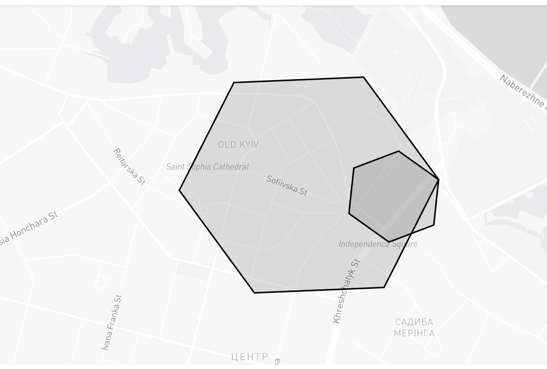

So the query:
```sql
select h3_ischildof(617527753363161087, 613024153737363455)
```
returns `true`.

### Distancing
Databricks also provides an API to measure distances on the H3 grid.

[h3_distance](https://docs.databricks.com/aws/en/sql/language-manual/functions/h3_distance) returns the distance in number of cells of the same resolution. Note: both cells must have the same resolution, otherwise an error will be raised. Alternatively, you can use [h3_try_distance](https://docs.databricks.com/aws/en/sql/language-manual/functions/h3_try_distance) that returns `null` instead.
For example, the distance for two cells of 9th resolution:
```sql
select h3_distance(617527753372073983, 617527753363161087) as distance
```
gives 2. In other words, the distance between them is two cells of the same 9th resolution.

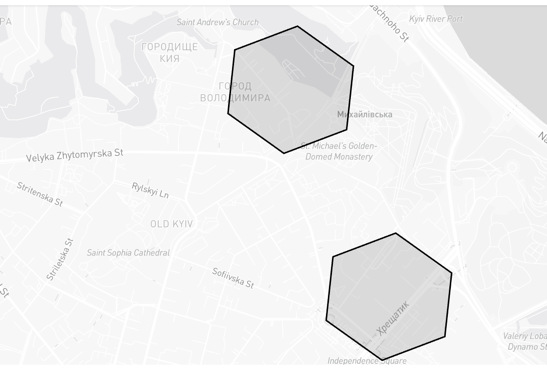

Needless to say, converting such a distance to kilometers is tricky, since such a distance can be measured in many ways:
between centroids, minimal distance between boundaries, or max distance between boundaries. H3 has a table of [Edge lengths](https://h3geo.org/docs/core-library/restable/#edge-lengths)
which can be considered the cell radius and used for distance measuring. But this should only be used for distances where Earth's curvature can be neglected, otherwise discrepancies will be too large.

```sql
select h3_distance(617527753372073983, 617527753363161087) * 0.200786148 * 2 * 1000 as distance_m
```
where:
- `0.200786148` - edge length for resolution 9.
- `2` - multiplies the edge length to get the diameter.
- `1000` - multiplies to convert kilometers to meters.

This returns a distance of 800 meters.
With the following query, we can get the precise spheroid distance between the centroids of these two cells:
```sql
select st_distancespheroid(st_geomfromwkt(h3_centeraswkt(617527753372073983)), st_geomfromwkt(h3_centeraswkt(617527753363161087))) as distance_m
```
That returns a result of 673 meters.

One of H3's advantages over other indexes like [geo hash](https://medium.com/@ivan-kurchenko/e1e817616442) is [h3_hexring](https://docs.databricks.com/aws/en/sql/language-manual/functions/h3_hexring), which returns neighboring cells at a given grid distance from the input cell. This can be especially useful for use cases such as geofencing with a certain approximation.
Let's consider the example of cell ID "617527753363161087", which is located almost in the center of Kyiv.

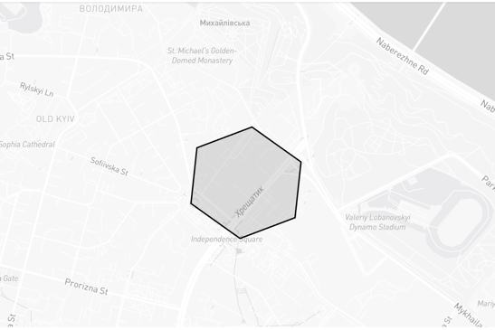

The query to get neighbors at distance 2:
```sql
select h3_hexring(617527753363161087, 2)
```
returns an array of neighboring cells at that distance:
```["617527753372073983","617527753363947519","617527753364471807","617527753363423231","617527767765090303","617527767765352447","617527753382297599","617527753381773311","617527753383084031","617527753390948351","617527753390161919","617527753391734783"]```

The visualization of these cells looks as follows:
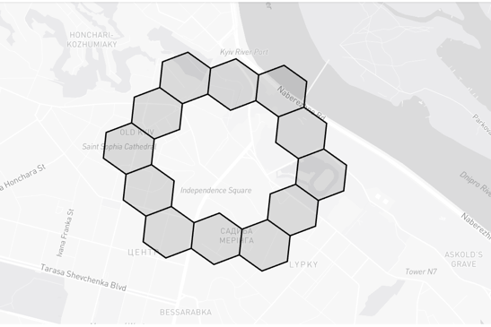

As you may notice, `h3_hexring` returns only the ring border. For cases when the entire area needs to be covered, [h3_kring](https://docs.databricks.com/aws/en/sql/language-manual/functions/h3_kring) is helpful:
```sql
select h3_kring(617527753363161087, 2)
```
returns the entire area covered with cells at a distance of 2: `["617527753363161087","617527753362898943","617527753363685375","617527753383346175","617527753382821887","617527753390686207","617527753364209663","617527753363947519","617527753364471807","617527753363423231","617527767765090303","617527767765352447","617527753382297599","617527753381773311","617527753383084031","617527753390948351","617527753390161919","617527753391734783","617527753372073983"]`
You can compare the visualization with the previous result:
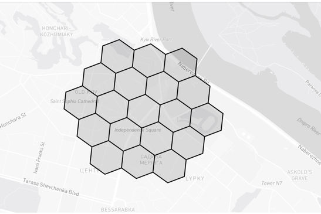

[h3_kringdistances](https://docs.databricks.com/aws/en/sql/language-manual/functions/h3_kringdistances) is a version of `h3_kring` that returns an array of structs with two fields: `cellid` - cell ID, and `distance` - distance in cells from the given center.

### Traversal
As mentioned at the beginning, H3 is a hierarchical index. In this section, we will explore part of the API for traversing the hierarchy.
To get a list of child cells, you can use [h3_tochildren](https://docs.databricks.com/aws/en/sql/language-manual/functions/h3_tochildren).

Let's consider the previous example of cell "617527753363161087" with resolution 9.
```sql
select h3_tochildren(617527753363161087, 10)
```
That will give us the following result: `["622031352990302207","622031352990334975","622031352990367743","622031352990400511","622031352990433279","622031352990466047","622031352990498815"]`
Visually, it can be represented as follows, including the "617527753363161087" parent cell for visibility:

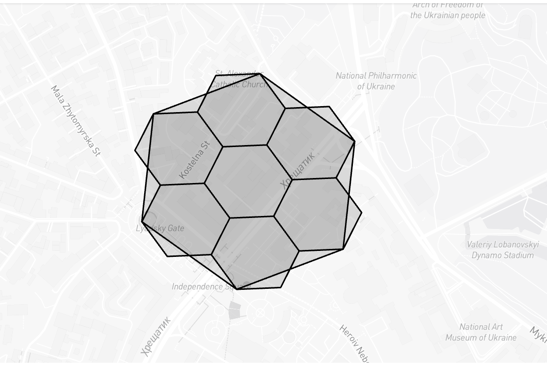

Conversely, to get the parent cell, we can use [h3_toparent](https://docs.databricks.com/aws/en/sql/language-manual/functions/h3_toparent).

Using our previous example, the following query:
```sql
select h3_toparent(617527753363161087, 8)
```
returns the value "613024153737363455". Visually, both cells look as follows:
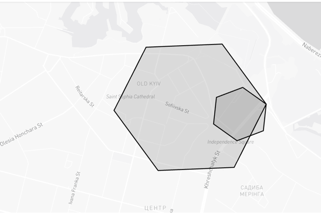

These are perhaps the main methods to consider. Additionally, Databricks provides the following convenience functions:
- [h3_maxchild](https://docs.databricks.com/aws/en/sql/language-manual/functions/h3_maxchild) - get the child of the integer max value.
- [h3_minchild](https://docs.databricks.com/aws/en/sql/language-manual/functions/h3_minchild) - get the child of the integer min value.
- [h3_resolution](https://docs.databricks.com/aws/en/sql/language-manual/functions/h3_resolution) - get the resolution of a cell;

### Compaction
Let's imagine you are working with a large area covered by cells with a resolution smaller than the area itself.
For instance, we can generate such a set by taking a large number of neighbors for a cell:
```sql
select h3_kring(617527753363161087, 6)
```
That results in 127 cells. The visualization is as follows:
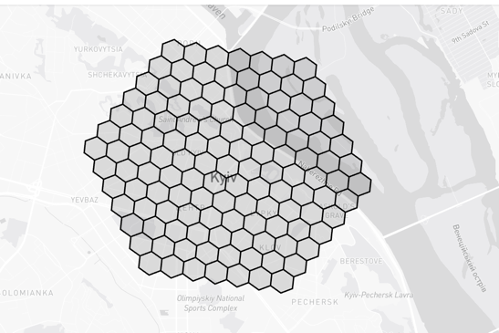

As you can guess, some of them can be "joined" without losing precision. This is where [h3_compact](https://docs.databricks.com/aws/en/sql/language-manual/functions/h3_compact) helps. So the query:
```sql
select h3_compact(h3_kring(617527753363161087, 6))
```
returns an array of 19 elements that can be drawn as follows:

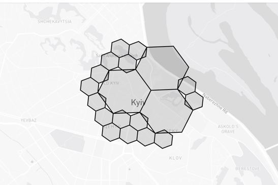

Similarly, [h3_uncompact](https://docs.databricks.com/aws/en/sql/language-manual/functions/h3_uncompact) can revert an array of cells from a compacted state back to a specific resolution.

### Conclusion
Today we reviewed how to work with the H3 index.

Although we covered the main topics, some more detailed yet important APIs were left out of scope:
- [Conversions](https://docs.databricks.com/aws/en/sql/language-manual/sql-ref-h3-geospatial-functions#conversions)
- [Validity](https://docs.databricks.com/aws/en/sql/language-manual/sql-ref-h3-geospatial-functions#validity)

H3 indexing is especially useful for solving many geospatial problems like reverse geocoding, geofencing, and similar use cases when precision can be sacrificed for the benefit of performance.

### References
- https://h3geo.org/docs
