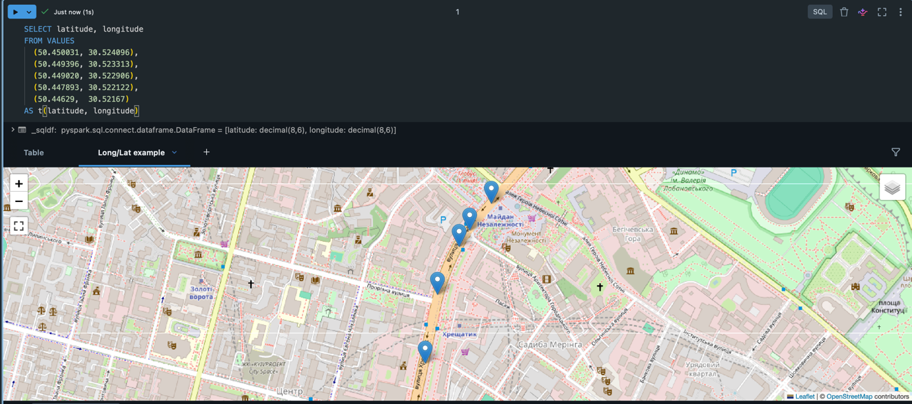
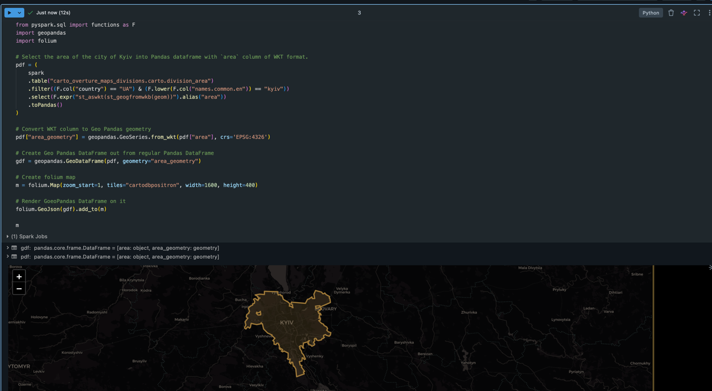
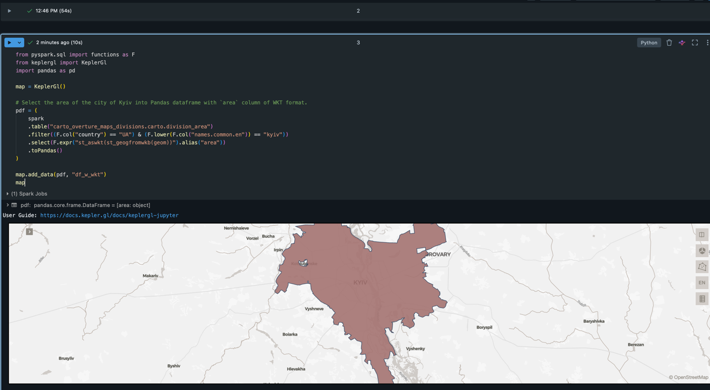
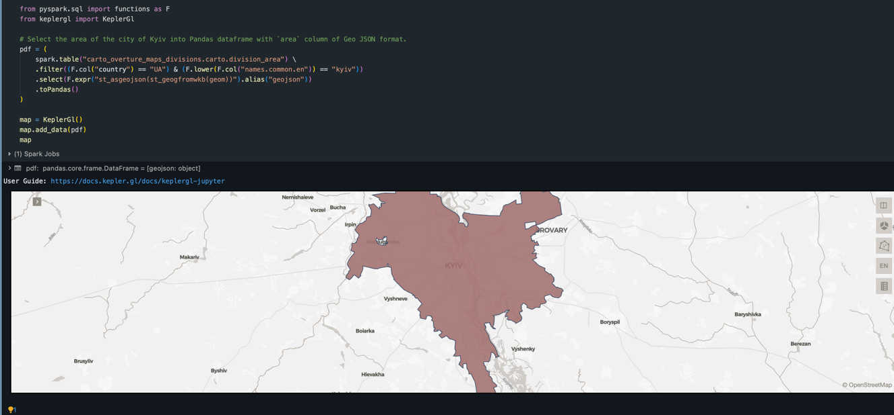
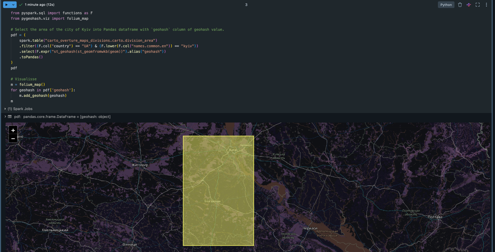
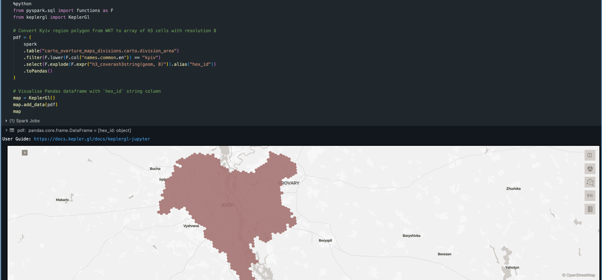
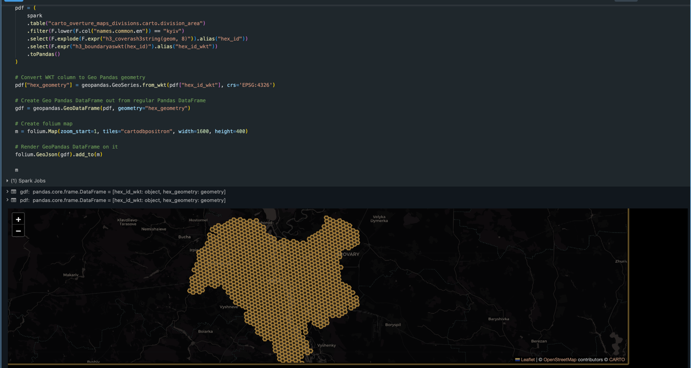

## Geospatial Data in Databricks — Part 3: Visualisation

## Introduction
The following series of blog posts focuses on working with geospatial data in Databricks.
In the previous two parts of the series, we covered the theoretical basis, `ST_*` and `H3_*` families of functions.
This post focuses on another aspect of working with the data — visualisation.

As you may have already gathered from the previous posts, working with geospatial data differs from other plain tabular data types, especially in terms of debugging. For instance, to investigate why a point:
```
POINT(30.525266 50.449621)
```
lies outside an expected polygon:
```
POLYGON ((30.5235417 50.4499077, 30.5243239 50.4504775, 30.5227595 50.4512945, 30.522253 50.4511905, 30.5220898 50.4508967, 30.5235417 50.4499077))
```
both objects should be shown on a map.
This is just one example, which can be generalised — geospatial data, like any other type of data, requires visualisation tools for various purposes, from low-level inspection to high-level analysis.
This is what we're going to explore today.
Before we proceed, it is worth mentioning that there are many excellent online tools for this purpose. The Overture Maps dataset used in the examples is also available in [Databricks Marketplace](https://docs.overturemaps.org/getting-data/data-mirrors/databricks/), making access much easier through the integrated experience.

## Visualise Longitude and Latitude
Let's start with the simplest case: visualising a point described by longitude and latitude.
Databricks offers a [built-in notebook experience](https://docs.databricks.com/aws/en/dashboards/manage/visualizations/maps#point-map-options)
that allows you to show such points on a map.
Let's take the following example:
```sql
SELECT latitude, longitude
FROM VALUES
  (50.450031, 30.524096),
  (50.449396, 30.523313),
  (50.449020, 30.522906),
  (50.447893, 30.522122),
  (50.44629,  30.52167)
AS t(latitude, longitude)
```
Then in the notebook visualisation they can be shown as markers:


## Visualise `GEOMETRY` and `GEOGRAPHY`
For more complex cases involving generic `GEOMETRY` and `GEOGRAPHY` types, external tools are required.
Visualising geographic objects is a well-explored problem, and you can find a number of tools that handle it well.
For instance, you can find a list of tools for [GeoPandas](https://geopandas.org/en/stable/community/ecosystem.html#visualization).

For the sake of brevity, we will focus on the most popular libraries in this space.

### Geo-pandas and Folium
[GeoPandas](https://geopandas.org), similarly to the well-known Pandas library, provides the ability to work with in-memory
dataframes with a `geometry` column built on Shapely objects. The notable difference from a regular Pandas DataFrame
is that geometry column, which represents the geographic object associated with each row. [Folium](https://python-visualization.github.io/folium/latest/index.html)
is another Python library that allows rendering interactive maps from various sources, including GeoPandas dataframes.

To visualise a Spark dataframe with `GEOMETRY`, we first need to convert it to a `GeoPandas` dataframe and render
it with Folium. For a visualisation example, let's take the polygon of Kyiv, Ukraine, from the [Overture Maps divisions areas dataset](https://docs.overturemaps.org/schema/reference/divisions/division_area/).

First, make sure you have installed [`geopandas`](https://pypi.org/project/geopandas/) and [`folium`](https://pypi.org/project/folium/).

```python
from pyspark.sql import functions as F
import geopandas
import folium

# Select the area of the city of Kyiv into Pandas dataframe with `area` column of WKT format.
pdf = (
    spark
    .table("carto_overture_maps_divisions.carto.division_area")
    .filter((F.col("country") == "UA") & (F.lower(F.col("names.common.en")) == "kyiv"))
    .select(F.expr("st_aswkt(st_geogfromwkb(geom))").alias("area"))
    .toPandas()
)

# Convert WKT column to GeoPandas geometry
pdf["area_geometry"] = geopandas.GeoSeries.from_wkt(pdf["area"], crs='EPSG:4326')

# Create a GeoPandas DataFrame from a regular Pandas DataFrame
gdf = geopandas.GeoDataFrame(pdf, geometry="area_geometry")

# Create folium map
m = folium.Map(zoom_start=1, tiles="cartodbpositron", width=800, height=400)

# Render GeoPandas DataFrame on it
folium.GeoJson(gdf).add_to(m)

m
```

The result should look similar to the following:


### Kepler.gl
[Kepler.gl](https://kepler.gl) is another map rendering solution. To render Kyiv's polygon using Kepler, we simply pass it a Pandas dataframe without any additional configuration:

First, make sure you have installed [`keplergl`](https://pypi.org/project/keplergl/).

```python
from pyspark.sql import functions as F
from keplergl import KeplerGl
import pandas as pd

map = KeplerGl()

# Select the area of the city of Kyiv into Pandas dataframe with `area` column of WKT format.
pdf = (
    spark
    .table("carto_overture_maps_divisions.carto.division_area")
    .filter((F.col("country") == "UA") & (F.lower(F.col("names.common.en")) == "kyiv"))
    .select(F.expr("st_aswkt(st_geogfromwkb(geom))").alias("area"))
    .toPandas()
)

map.add_data(pdf, "df_w_wkt")
map
```
That gives us the following map:


## Visualise GeoJSON
Similarly, using Kepler.gl it is possible to visualise GeoJSON directly, without any additional transformations.
Let's take the previous example of the Kyiv region but reconvert WKB to GeoJSON this time:
```python
from pyspark.sql import functions as F
from keplergl import KeplerGl

# Select the area of the city of Kyiv into Pandas dataframe with `area` column of GeoJSON format.
pdf = (
    spark
    .table("carto_overture_maps_divisions.carto.division_area")
    .filter((F.col("country") == "UA") & (F.lower(F.col("names.common.en")) == "kyiv"))
    .select(F.expr("st_asgeojson(st_geogfromwkb(geom))").alias("geojson"))
    .toPandas()
)

map = KeplerGl()
map.add_data(pdf)
map
```

The result is the following interactive map:


## Visualise Geohash
[Geohashes](https://en.wikipedia.org/wiki/Geohash) were briefly touched upon [in the previous part](https://medium.com/gitconnected/geospatial-data-in-databricks-part-1-st-functions-e1e817616442).
As a quick reminder: a geohash is a hierarchical, square-based grid that consists of 12 precision levels filled using Z-curve order.
Each geohash cell is defined by an alphanumeric string, such as "u8vxn84u".

At the time of writing, neither Folium nor [Kepler.gl](https://github.com/keplergl/kepler.gl/issues/989) provides
geohash visualisation capabilities out of the box.

Note that unlike H3 — which provides `h3_coverash3string` to fill a polygon with cells — Databricks has no built-in function for geohash area coverage. The `ST_GeoHash` function computes the geohash of a geometry's representative point, yielding a single cell that encodes the location rather than covering the area.

First, make sure you have installed [`pygeohash`](https://pypi.org/project/pygeohash/).

```python
from pyspark.sql import functions as F
from pygeohash.viz import folium_map

# Compute the representative geohash for the Kyiv polygon (bounding box center).
pdf = (
    spark.table("carto_overture_maps_divisions.carto.division_area")
    .filter((F.col("country") == "UA") & (F.lower(F.col("names.common.en")) == "kyiv"))
    .select(F.expr("st_geohash(st_geomfromwkb(geom))").alias("geohash"))
    .toPandas()
)

# Create and show the map with the geohash
m = folium_map()
for geohash in pdf['geohash']:
    m.add_geohash(geohash)
m
```
This will give you the following visualisation of the representative geohash cell for Kyiv's polygon:


## Visualise H3
[H3](https://h3geo.org/) indexes were covered in [the previous part of the series](https://medium.com/gitconnected/geospatial-data-in-databricks-part-2-h3-functions-45b07439fb57).
To refresh our memory on the subject, H3 is a geospatial hierarchical index that subdivides the globe primarily into hexagons and consists of 16 resolution levels.
Each hexagon cell can be represented by a 64-bit integer that encodes metadata such as its resolution.

### Kepler.gl
Kepler provides a dedicated [H3 layer](https://github.com/keplergl/kepler.gl/blob/master/docs/user-guides/c-types-of-layers/j-h3.md),
making H3 cell index visualisation effortless. All that is required is to provide a Pandas dataframe with at least a `hex_id`
column containing H3 cell IDs.

```python
from pyspark.sql import functions as F
from keplergl import KeplerGl

# Convert Kyiv region polygon from WKT to array of H3 cells with resolution 8
pdf = (
    spark
    .table("carto_overture_maps_divisions.carto.division_area")
    .filter(F.lower(F.col("names.common.en")) == "kyiv")
    .select(F.explode(F.expr("h3_coverash3string(geom, 8)")).alias("hex_id"))
    .toPandas()
)

# Visualise Pandas dataframe with `hex_id` string column
map = KeplerGl()
map.add_data(pdf)
map
```
That gives us a nice interactive map:


### Folium
Unfortunately, at the time of writing there is no straightforward way to draw H3 cells in Folium. Of course, it is always
possible to use a [custom implementation](https://jens-wirelesscar.medium.com/lhexagone-in-hexagons-uber-h3-map-1566bc412172), but let's keep it simple.
Luckily, Databricks provides a number of [export functions](https://docs.databricks.com/aws/en/sql/language-manual/sql-ref-h3-geospatial-functions#export) for H3
which we can use to convert H3 cells to already familiar formats such as WKT and reuse the tools demonstrated above.

```python
from pyspark.sql import functions as F
import geopandas
import folium

# Convert Kyiv region polygon from WKT to array of H3 cells with resolution 8 and convert each cell to WKT of cell boundaries
pdf = (
    spark
    .table("carto_overture_maps_divisions.carto.division_area")
    .filter(F.lower(F.col("names.common.en")) == "kyiv")
    .select(F.explode(F.expr("h3_coverash3string(geom, 8)")).alias("hex_id"))
    .select(F.expr("h3_boundaryaswkt(hex_id)").alias("hex_id_wkt"))
    .toPandas()
)

# Convert WKT column to GeoPandas geometry
pdf["hex_geometry"] = geopandas.GeoSeries.from_wkt(pdf["hex_id_wkt"], crs='EPSG:4326')

# Create a GeoPandas DataFrame from a regular Pandas DataFrame
gdf = geopandas.GeoDataFrame(pdf, geometry="hex_geometry")

# Create folium map
m = folium.Map(zoom_start=1, tiles="cartodbpositron", width=1600, height=400)

# Render GeoPandas DataFrame on it
folium.GeoJson(gdf).add_to(m)

m
```
Which gives us the following visualisation with each cell drawn separately:



## Conclusion
In this part, we explored how to visualise geospatial data. This unlocks a variety of use cases,
from low-level data troubleshooting to building visuals for high-level analytics.
In the next part, we will go over a topic partially touched on here: open-source data.


## References
- https://docs.databricks.com/aws/en/dashboards/manage/visualizations/maps#point-map-options
- https://geopandas.org/en/stable/community/ecosystem.html#visualization
